# DeepFish Agent Architecture

## System Overview

---

## Agent File Structure

---

## Prompt Assembly

---

## Event Flow (Bus Architecture)

```mermaid
sequenceDiagram
    participant U as User
    participant V as Vesper
    participant M as Mei
    participant B as Bus
    participant W as Workers
    
    U->>V: Request
    V->>V: Detect intent
    V->>M: intent_detected
    M->>M: Decompose task
    M->>B: Dispatch tasks
    M->>M: 💤 Sleep
    
    B->>W: Task A, B, C
    
    par Parallel Execution
        W->>W: Execute Task A
        W->>W: Execute Task B
        W->>W: Execute Task C
    end
    
    W->>B: task_complete
    B->>M: ⏰ Wake (event)
    M->>M: Check dependencies
    M->>U: Deliver result
```

---

## Agent Roster

| Agent | Title | Bus Role | Core | Skins |
|-------|-------|----------|------|-------|
| **Mei** | Project Manager | dispatcher | ✓ | Classic |
| **Oracle** | Chief Architect | advisor | ✓ | Classic |
| **Vesper** | Receptionist | router | ✓ | Classic |
| **Hanna** | Creative Director | worker | ✓ | Classic, Sora ✨, Evie 🌙 |
| **IT** | Principal Architect | worker | ✓ | Classic |
| **Sally** | Marketing & SEO | worker | ✗ | Classic |

---

## Design Principles

### The Deep Way
> "We do not move fast. We create the highest quality work in the world."

1. **Design First** — Hanna creates assets before IT writes code
2. **Hardened Code** — IT engineers Systems, not scripts
3. **Boutique Quality** — Accuracy over speed, elegance over complexity

### Compartmentalization
- **agent.json** — What the engine needs (model, tools, bus)
- **personality.json** — What the agent IS (backstory, voice)
- **user.json** — What the agent LEARNS (preferences, memory)
- **skin.json** — Alternative personality overlay

### No Bottlenecks
- Mei sleeps during execution
- Workers operate in parallel
- Events wake Mei only when needed
